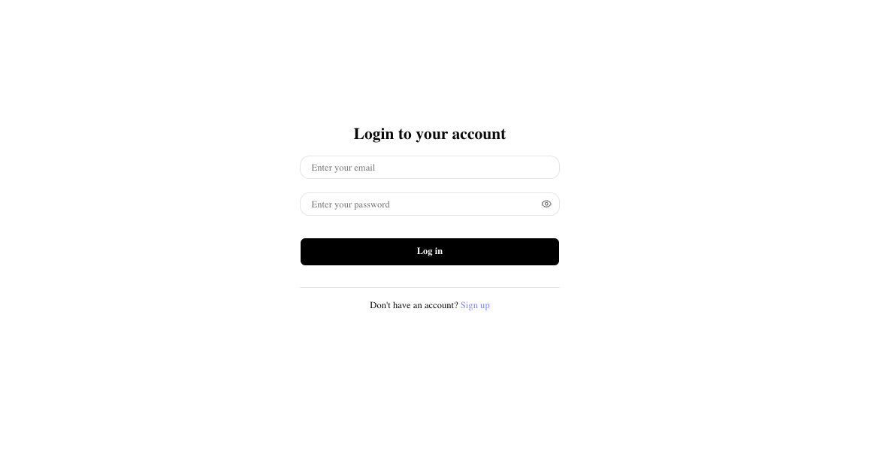
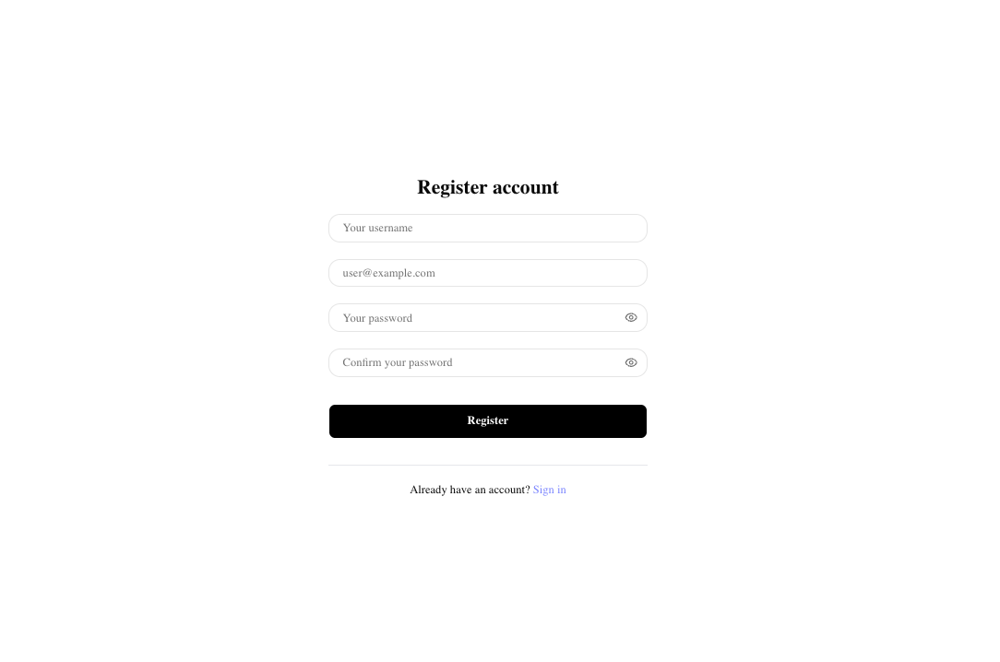
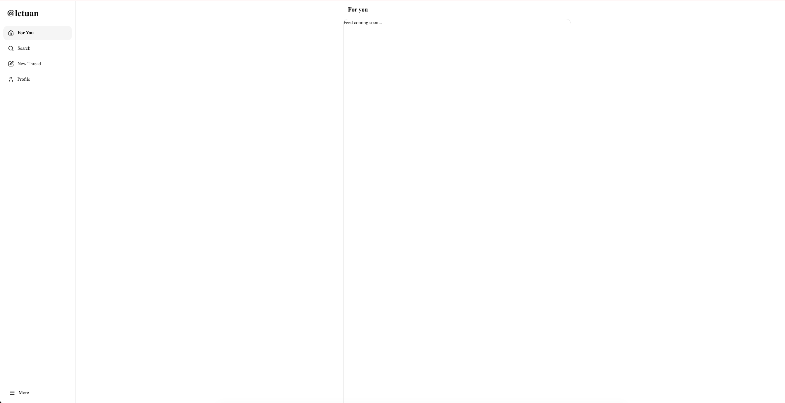
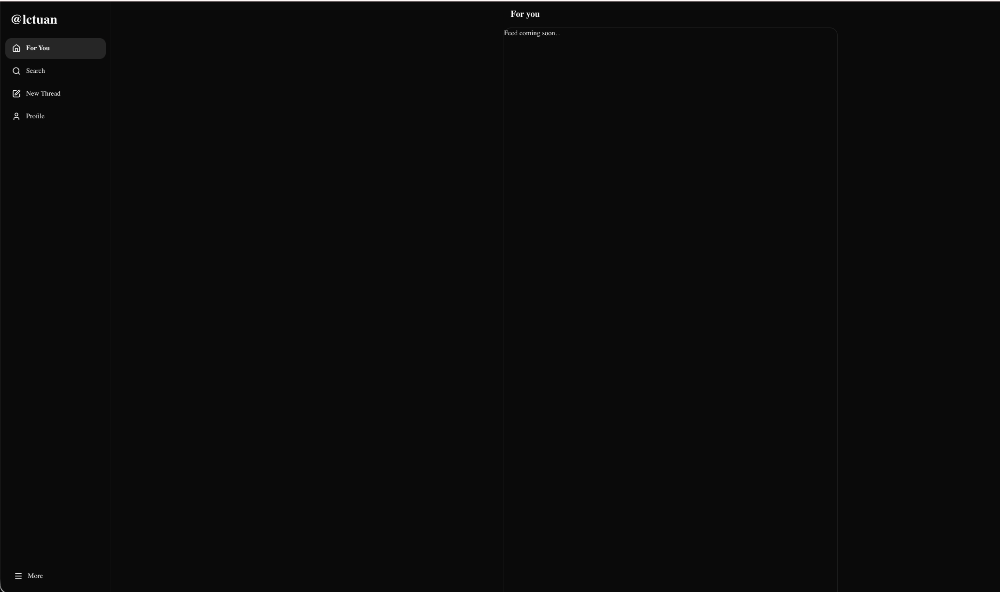
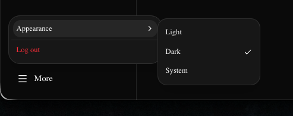

# Feed App (Next.js)

A full-stack authentication starter built with **Next.js (App Router)**, **TypeScript**, **Supabase Auth**, and **Prisma ORM**. This project focuses on a production-style sign-up/sign-in flow with a synced user model between Supabase and a PostgreSQL database via Prisma, and a shared user session available across the app through React Context.

> 🚧 **Status**: Work in progress. Currently implements authentication and user sync;

## Features

- **Sign up / Sign in** with Supabase Auth, using `@supabase/ssr` for cookie-based sessions (server-rendered auth state, no client-side token juggling).
- **User sync to Prisma**: on login, verify the Supabase-authenticated user and sync it into the application's own PostgreSQL database via Prisma, so app data can reference a first-class `User` model instead of only the Supabase auth user.
- **Shared user session via React Context**: the authenticated user is loaded once and made available across client components through a Context provider, avoiding prop drilling and redundant auth checks.
- **Form validation** with React Hook Form + Zod for sign-up/sign-in forms.
- **UI** built with Tailwind CSS v4 and shadcn/ui components.

## Tech Stack

| Layer              | Technology                                                             |
| ------------------ | ---------------------------------------------------------------------- |
| Framework          | Next.js (App Router), React 19, TypeScript                             |
| Auth               | Supabase Auth (`@supabase/ssr`, `@supabase/supabase-js`)               |
| Database / ORM     | PostgreSQL, Prisma ORM (`@prisma/adapter-pg`)                          |
| Forms & Validation | React Hook Form, Zod                                                   |
| State              | React Context (shared user/session)                                    |
| UI                 | Tailwind CSS v4, shadcn/ui, lucide-react, sonner (toasts), next-themes |

## Getting Started

### Prerequisites

- Node.js 18+
- A [Supabase](https://supabase.com) project (for Auth + Postgres, or bring your own Postgres instance)

### Setup

1. Clone the repo:

   ```bash
   git clone https://github.com/lctuan0807/feed-nextjs.git
   cd feed-nextjs
   ```

2. Install dependencies:

   ```bash
   npm install
   ```

3. Configure environment variables — create a `.env` file:

   ```bash
   NEXT_PUBLIC_SUPABASE_URL=your-supabase-project-url
   NEXT_PUBLIC_SUPABASE_PUBLISHABLE_KEY=your-supabase-publishable-key
   DATABASE_URL=your-postgres-connection-string
   NEXT_PUBLIC_APP_URL=http://localhost:3000
   ```

4. Run Prisma migrations and generate the client:

   ```bash
   npx prisma migrate dev
   npx prisma generate
   ```

5. Start the development server:
   ```bash
   npm run dev
   ```
   Open [http://localhost:3000](http://localhost:3000).

## Project Structure (high level)

```
├── prisma/              # Prisma schema and migrations
├── src/
│   ├── app/             # Next.js App Router routes
│   ├── components/      # UI components (shadcn/ui-based)
│   ├── lib/             # Supabase client, Prisma client, utilities
│   ├── features/        # Feature-specific code (auth, etc.)
│   └── providers/       # React Context providers
├── components.json      # shadcn/ui config
└── package.json
```

## Screen

### Login



### Register



### Home




### More Menu Button



## Author

**Tuan Le Cong** — [GitHub](https://github.com/lctuan0807)
